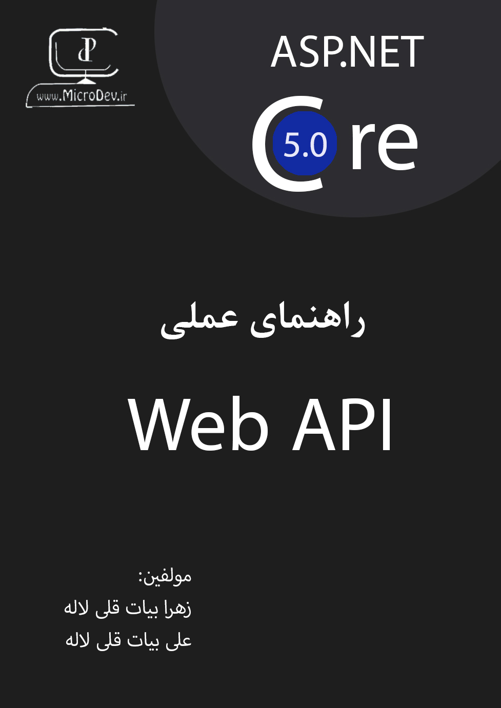

## Give a Star! :star:
If you like this project, learn something or you are using it in your applications, please give it a star. Thanks!

# ASP.NET Core 5.0 WebAPI

Welcome to the Git repo that is associated with the book
**[ASP.NET Core 5.0 WebAPI](https://github.com/ZahraBayatgh/)**
published by [LinkedIn](https://www.linkedin.com/in/zahrabayat/).
This book details how to use ASP.NET Core 5.0 WebAPI to Enterprise real world application in [.NET Core](https://www.microsoft.com/net) applications.

This Git repo contains all the code in the book, plus an
[free pdf book](https://github.com/ZahraBayatgh/ASP.NET-Core-5.0-Web-API/blob/master/ASP.NETCore5.0WebAPI.pdf)
that I wrote, in persian.

| ASP.NET Core 5.0 WebAPI |
| ------------|
|  |  |  |
|  <a href='https://github.com/ZahraBayatgh/ASP.NET-Core-5.0-Web-API/blob/master/ASP.NETCore5.0WebAPI.pdf'>**Download .PDF**</a>   
